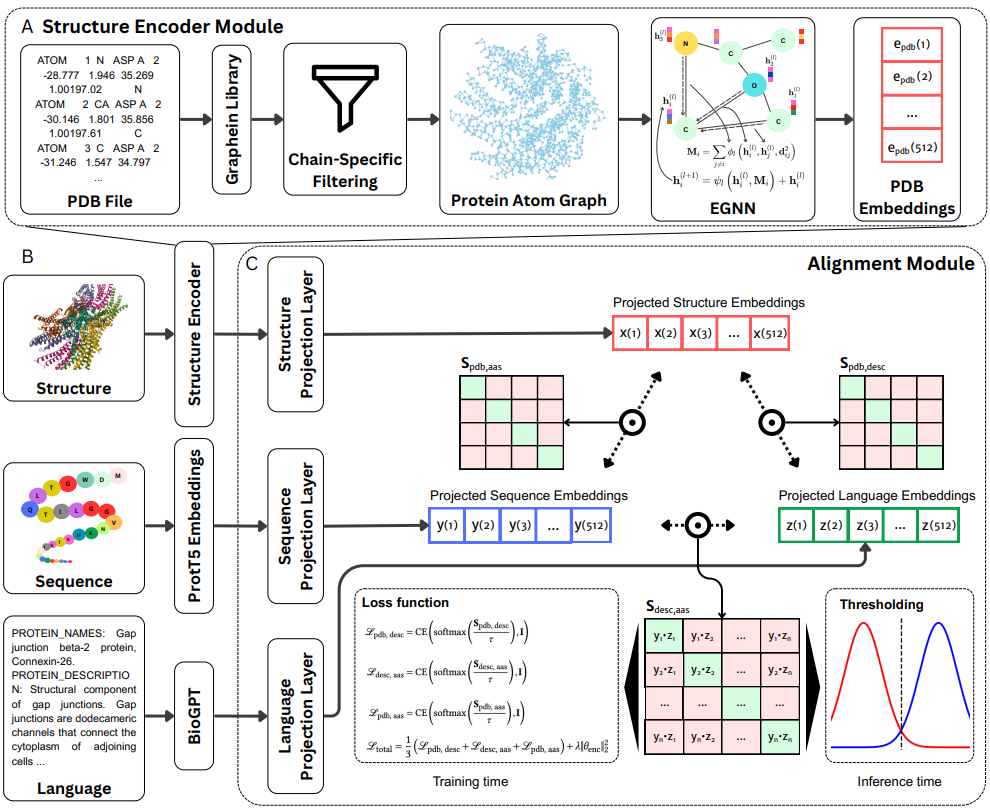

# CLASP: Contrastive Learning of Amino acid, Structure, and Protein description

**CLASP** is a tri-modal contrastive learning framework for unified representation of protein structure, sequence, and description. It enables downstream applications such as cross-modal retrieval, similarity scoring, and zero-shot classification by learning a shared embedding space across all three modalities.


## Table of contents
1. [Overview of the CLASP framework](#overview-of-the-clasp-framework) 
2. [Repository structure](#repository-structure)
3. [Environment setup](#environment-setup)
4. [Documentation and usage](#documentation-and-usage)
5. [Versions tested](#versions-tested)
6. [Typical install and run time](#typical-install-and-run-time)
7. [Citation](#citation)

## Overview of the CLASP framework

CLASP (Contrastive Learning of Amino acid, Structure, and Protein description) is a tri-modal contrastive learning framework designed to unify protein structure (as PDB files), amino acid sequence, and natural language description into a shared embedding space. By learning aligned representations across these biologically complementary views, CLASP supports downstream applications such as cross-modal retrieval, similarity scoring, and zero-shot classification without requiring task-specific supervision.

Each modality is first encoded independently: protein structures are converted into residue-level graphs using [Graphein](https://graphein.ai/) and embedded via an [E(3)-invariant graph neural network (EGNN)](https://doi.org/10.48550/arXiv.2102.09844), amino acid sequences are embedded using pretrained language models like [ProtT5](https://doi.org/10.1109/TPAMI.2021.3095381), and textual descriptions are embedded using biomedical large language models such as [BioGPT](https://doi.org/10.1093/bib/bbac409). Lightweight projection heads then map all three modalities into a common vector space. CLASP is trained using a tri-modal contrastive loss that simultaneously encourages alignment between matching structure-sequence, structure-description, and sequence-description pairs. 

<p align="center">
  
</p>


## Repository structure

```
CLASP/
├── assets/                # directory for asset files
├── docs/                 
│   ├── data_preparation.md
│   ├── inference_utilities.md
│   ├── training_clasp.md
│   └── README.md
├── src/                   
|   ├── models/            # model definitions for CLASP
│   ├── utils/             # utility functions for data processing and model training
│   ├── compute_similarity_matrices.py
│   ├── eval_zero_shot_classification.py
│   ├── get_quick_similarity_scores.py
│   ├── preprocess_pdb_graphs.py
│   ├── rank_amino_acids_by_description.py
│   ├── train_clasp.py     
├── .gitignore             
├── environment.yml       
└── README.md      
```        


## Environment setup

```bash
conda env create -f environment.yml
conda activate claspenv
```

After activating the environment, you need to manually install `torch-scatter` to match your device. For example, we use the following command for a CUDA 12.4 compatible setup with PyTorch 2.6.0 (this command will very if you use a CPU-only setup or a different CUDA version):

```bash
pip install torch-scatter==2.1.2+pt26cu124 -f https://data.pyg.org/whl/torch-2.6.0+cu124.html
```

On a CPU-only setup, you can use:

```bash
pip install torch-scatter==2.1.2 -f https://data.pyg.org/whl/torch-2.6.0+cpu.html
```

## Documentation and usage

This repository provides a set of utilities and scripts for preparing data, training the CLASP model, evaluating its performance, and running inference. Below is a summary of key components, their purposes, and where to find detailed instructions. More information can be found [in the documentation](docs/README.md).

| Component                                                                            | Purpose                                                                                            | Documentation                                           |
| ------------------------------------------------------------------------------------ | -------------------------------------------------------------------------------------------------- | ------------------------------------------------------- |
| [`preprocess_pdb_graphs.py`](src/preprocess_pdb_graphs.py)                           | Converts `.pdb` files into residue-level graphs compatible with CLASP                              | [`data_preparation.md`](docs/data_preparation.md)       |
| [`compute_similarity_matrices.py`](src/compute_similarity_matrices.py)              | Computes projected embeddings and similarity matrices between structure, sequence, and description | [`inference_utilities.md`](docs/inference_utilities.md) |
| [`get_quick_similarity_scores.py`](src/get_quick_similarity_scores.py)               | Prints similarity scores for a single triplet (structure, sequence, description)                   | [`inference_utilities.md`](docs/inference_utilities.md) |
| [`rank_amino_acids_by_description.py`](src/rank_amino_acids_by_description.py)       | Ranks amino acid sequences based on a natural language query                                       | [`inference_utilities.md`](docs/inference_utilities.md) |
| [`train_clasp.py`](src/train_clasp.py)                                               | Main training script for CLASP                                                                     | [`training_clasp.md`](docs/training_clasp.md)           |
| [`eval_zero_shot_classification.py`](src/eval_zero_shot_classification.py)           | Evaluates a trained CLASP model on zero-shot classification tasks (PDB–AAS, PDB–DESC, AAS–DESC)    | [`evaluation.md`](docs/evaluation.md)                   |

## Versions tested

CLASP has been trained and tested with the following versions:

- Python 3.10
- PyTorch 2.6.0
- Graphein 1.7

For a full list of dependencies, please refer to the `environment.yml` file.

## Typical install and run time

The typical installation time for the CLASP environment is approximately 5-10 minutes, depending on your internet connection and system performance. The training time for the CLASP model on a standard GPU (e.g., NVIDIA RTX 3090 with 32 CPU cores) is approximately 13.08 hours (∼2 minutes per epoch) when using the datasets and hyperparameters specified in the documentation. The training time may vary based on the specific hardware configuration, dataset size, and hyperparameters used.


## Citation

Coming soon

